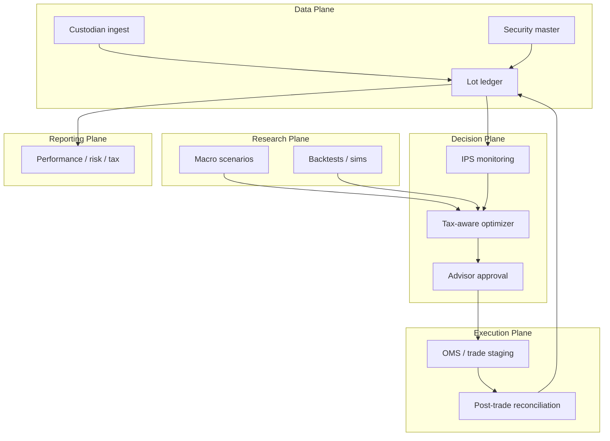

# Sharpe Founding Investment Engineer — Research Brief

Structured synthesis of Sharpe's founding investment engineer role: first-six-month
priorities, investment workflows, tax-aware optimization, and platform architecture.

**Primary source:** [Sharpe - Founding Investment Engineer.pdf](file:///Users/hcarstens/Downloads/Sharpe%20-%20Founding%20Investment%20Engineer%20.pdf)

**Research run:** `runs/research/sharpe-founding-investment-engineer-2026/20260614T120000Z0000/`
(quality score 10/10, credence 0.45)

**Config:** `configs/research_agents/sharpe_founding_investment_engineer_20260614.json`

---

## Company context

Sharpe is a Bay Area tech-enabled **multi-family office for ultra-high-net-worth
(UHNW) clients**. The core bet is a **wealth data model** over assets, entities,
contracts, and relationships — powering tax planning, simulations, and investment
optimization with **after-tax wealth** as the north star.

The founding investment engineer role spans **investment platform, optimization
systems, and core infrastructure** — not a siloed quant researcher or pure data
engineer.

---

## 1. First six months — what the priorities entail

The job description lists three **parallel** priorities (not sequential gates):

| Priority | Likely meaning in months 1–6 |
| --- | --- |
| **Investment workflows foundation** | Custodian ingest → normalized positions → daily P&L → household views → audit trail. Not full OMS on day one. |
| **Tax-aware optimization framework v0** | After-tax objective, constraint library, solver on sample portfolios, plus sim/backtest harness |
| **Core infrastructure & data models** | Entity graph, security master, lot ledger, corporate actions, deterministic simulation jobs |

### Realistic timeline

```text
Weeks 1–4   Discovery — workflow catalog, data sources, schema design
Weeks 5–12  Vertical slice — one custodian, one household, end-to-end demo
Weeks 13–26 Hardening — pilot clients, reconciliation, advisor review flows
```

### Concrete deliverables

- **Workflow catalog** with owner, inputs, outputs, and SLA for: onboarding, IPS
  capture, rebalance proposal, trade staging, reconciliation, tax lot refresh,
  reporting
- **Security master v0** — symbology (CUSIP/ISIN/ticker), asset class, tax character,
  wash-sale substitute groups
- **Lot-level ledger** — cost basis, holding period, wash-sale chains
- **Optimizer v0** on sample portfolios with explainable trade lists
- **Sim/backtest harness** — historical prices + lot state → proposed trades →
  after-tax outcome vs baseline
- **Research sandbox** isolated from production client data (walk-forward discipline)

### Likely scope cuts

Single custodian, public markets (equities/ETFs), manual entry for alternatives,
heuristics before full mixed-integer optimization.

### Primary risk

Wealth-tech startups most often stall on **reconciliation and compliance**, not
optimization math. Build **positions-first, trading-second**.

---

## 2. Investment workflows and systems

Five operational planes:



### Six core workflows

1. **Onboarding** — entity mapping, account linking, IPS digitized as machine-readable
   policy objects on the household graph
2. **Daily refresh** — custodian → reconcile → update lots → corporate actions →
   exception queue for breaks
3. **Policy monitoring** — drift vs strategic allocation, concentration, liquidity,
   alternatives capital-call calendar
4. **Research / scenario** — macro what-ifs feeding optimizer and advisor narrative
   (not auto-trade at UHNW by default)
5. **Rebalance + tax overlay** — target weights → TLH / gain deferral / asset location
   → advisor review → staged orders → post-trade compliance
6. **Alternatives** — manual marks, capital calls and distributions, separate sub-ledger

### Systems map

| System | Role |
| --- | --- |
| Data warehouse / lake | Custodian files, market data, analytics |
| Security master | Instrument identity and attributes |
| Portfolio accounting | Positions, lots, P&L |
| Risk analytics | Exposure, concentration, liquidity |
| Optimizer service | Tax-aware trade generation |
| OMS / EMS | Trade staging and routing (later phase) |
| Document store | IPS, contracts, alt docs |
| Workflow / approval | Advisor sign-off gates |
| Audit log | Who changed what, when |

UHNW reality: **human approval gates dominate**; low trade frequency, high exception
handling. Event-driven updates (position changed → re-run drift; tax lot updated →
invalidate cached optimization) beat batch-only at scale.

---

## 3. Tax-aware optimization framework

Goal is **after-tax wealth maximization**, not pre-tax Sharpe alone.

### Objective (v0)

Maximize expected after-tax utility subject to tracking error vs policy benchmark,
turnover budget, minimum cash, and short-term vs long-term capital gains rates.

### Decision variables

- Per-lot sell/hold (binary at lot granularity for concentrated UHNW positions)
- Buy amounts by asset
- Account placement (taxable vs IRA vs trust)
- Harvest pairs

### Constraints

| Type | Examples |
| --- | --- |
| **Hard** | IPS min/max weights, concentration, liquidity, 30-day wash-sale, restricted lists, do-not-sell legacy lots |
| **Soft** | Prefer LT over ST gains, defer low-basis gains, harvest high-basis losses, asset-locate bonds/REITs in tax-deferred accounts |

### Architecture pattern

```text
Household tax state + lot ledger + IPS
        ↓
Asset location layer (where to hold what)
        ↓
Rebalance / TLH optimizer (MIP or staged heuristics)
        ↓
Explainable trade list + estimated tax delta vs baseline
        ↓
Advisor review → staged execution
```

### Scenario hooks

Capital gains rate changes, state residency moves, Roth conversions, charitable
bunching — optimizer inputs **household tax state**, not portfolio weights alone.

### Solver approach

Lot discreteness and wash-sale graphs produce non-convex problems. Commercial stacks
use MIQP/MIP solvers (Gurobi, CPLEX) or staged heuristics (harvest first, then
rebalance). A pragmatic v0: ranked TLH heuristics + greedy rebalance, with a
documented upgrade path to full MIP.

### Governance

- Decision support, not autonomous alpha
- Every output needs rationale: which lots, binding constraints, tax delta vs baseline
- Cross-account wash-sale requires **household graph queries**
- Version-pin tax rates, substitute groups, and optimizer configs for audit replay
- Backtest tax strategies with purged walk-forward; report after-tax metrics net of
  implementation shortfall

---

## 4. Infrastructure and data models

The PDF's "assets, entities, contracts, relationships" maps directly to:

| PDF concept | Data model |
| --- | --- |
| **Entities / relationships** | Graph: Person, Household, Trust, LLC, Account, Beneficiary, Custodian — edges for ownership, control, beneficiary-of |
| **Assets** | Security master: symbology, asset class, tax character, liquidity tier, wash-sale substitute group |
| **Contracts** | Versioned IPS, mandates, fee schedules, alt subscription docs — effective-dated |
| **Holdings** | Lot ledger: Account × Instrument × Lot (qty, basis, acquisition date, wash-sale chain) |
| **Events** | Immutable transaction stream: trades, transfers, dividends, capital calls, marks |
| **Simulations** | Job records: input snapshot ID, config hash, output trades, projected tax ledger |

### Entity graph (v0)

```text
Person ──owns──> Trust ──holds──> Account ──custodied_at──> Custodian
  │                │
  └──beneficiary_of┘
LLC ──owns──> Account
Household ──aggregates──> Person, Trust, Account
```

### Likely infrastructure

| Layer | Technology pattern |
| --- | --- |
| Transactional ledger | Managed Postgres (ACID for reconciliation) |
| Entity / relationship view | Graph or document store derived from ledger |
| Files | Object store for custodian uploads and documents |
| Jobs | Queue + worker for optimization and simulation |
| Security | Row-level security on `household_id`, audit log |
| Environments | Cloud-native, IaC for dev/staging/prod |

### Build order

```text
Ledger + security master → entity graph → optimizer → OMS
```

Do not build OMS before reconciliation and security master v0 are trustworthy.

---

## Key uncertainties (clarify with Sharpe)

1. **Execution model** — in-house trading, custodian API, or advisor-only recommendations?
2. **System of record** — is the wealth graph authoritative, or custodian feed with Sharpe as overlay?
3. **Pilot scope** — one internal household vs external UHNW families?
4. **Tax engine depth** — AMT, NIIT, QSBS, trust DNI in v0, or external CPA integration?
5. **Build vs buy** — native ledger vs Addepar / Orion / Tamarac integration?

---

## Falsifiers — what would invalidate this brief

- First six months require only UI mockups without custodian ingest, lot ledger, or
  optimizer integration
- Tax optimizer optimizes pre-tax Sharpe while claiming after-tax outcomes
- Workflows skip reconciliation and operate on custodian snapshots without lot-level
  cost basis
- Data model stores account weights only with no entity graph or security master
- Production OMS ships before positions reconciliation and security master v0

---

## Source index

| Source ID | File |
| --- | --- |
| `sharpe-role-context` | `configs/research_agents/sources/sharpe_role_context_20260614.md` |
| `sharpe-first-six-months` | `configs/research_agents/sources/sharpe_first_six_months_20260614.md` |
| `sharpe-investment-workflows-systems` | `configs/research_agents/sources/sharpe_investment_workflows_systems_20260614.md` |
| `sharpe-tax-optimization-framework` | `configs/research_agents/sources/sharpe_tax_optimization_framework_20260614.md` |
| `sharpe-infrastructure-data-models` | `configs/research_agents/sources/sharpe_infrastructure_data_models_20260614.md` |
| `sharpe-wealth-platform-disconfirming` | `configs/research_agents/sources/sharpe_wealth_platform_disconfirming_20260614.md` |
| `sharpe-tax-optimization-limitations` | `configs/research_agents/sources/sharpe_tax_optimization_limitations_20260614.md` |

Cross-repo research also cited: `beat_bh_after_fees_taxes`, `backtest_walk_forward`,
`financial_friction_logistics_cost`.

### Re-run research

```bash
python -m forecasting.research_agent.scheduler run-once \
  --config configs/research_agents/sharpe_founding_investment_engineer_20260614.json
```
